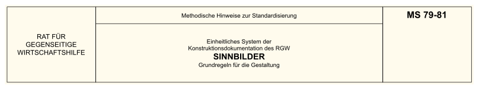

*
Abschrift aus TGL Textsammlung[†](#1)
["ESKD – Grundlagen"][MS 79-81]
*

---

[MS 79-81]: https://bauarchivddr.bbr-server.de/bauarchivddr/archiv/tglarchiv/tgl-em/tgl-em-013-1987.pdf#page=137 "ISBN 3-7405-0015-8 (Lizenz-Nr. 105-184/1/87) Einheitliches System der Konstruktionsdokumentation des RGW. Grundlagen. Ausgabe 1987, ab Seite 269"

Diese methodischen Hinweise legen die Grundregeln für die Gestaltung von
Sinnbildern, die in den Konstruktionsdokumenten aller Bereiche der Industrie
und des Bauwesens angewendet werden, fest.

# 1. ALLGEMEINES

<dl><dt>1.1.</dt><dd>

Sinnbilder sind bestimmt für:

1. sinnbildliche Darstellungen von Erzeugnissen in Schemata;
2. sinnbildliche Darstellungen der wesentlichen Bestandteile der Erzeugnisse
   und ihrer funktionellen und strukturellen Zusammenhänge in Schemata;
3. Übermittlung von Informationen in Zeichnungen und Schemata über die
   geforderte Beschaffenheit von Erzeugnissen;
4. Übermittlung zusätzlicher Angaben in Zeichnungen und Schemata zur Erklärung
   der Darstellung der Erzeugnisse.

</dd><dt>1.2.</dt><dd>

Alle Sinnbilder sind in Abhängigkeit von ihrer Anwendung und Bedeutung in den
Zeichnungen und Schemata verschiedener Art und in Abhängigkeit von den
grafischen Gemeinsamkeiten ihrer Elemente in Familien einzuteilen.

Die Benennung der Sinnbilder muss in einer entsprechenden Dokumentation
erklärt werden. In Übereinstimmung mit der Hierarchie der Begriffe werden
Sinnbilder eingeteilt in:

1. Grundsinnbilder – für die Darstellung der Hauptmerkmale;
2. Zusatzsinnbilder – für die Darstellung zweitrangiger Merkmale
   (qualifizierende Sinnbilder).

In der Regel ist für jede Familie eine Grundfigur festzulegen, die der
einheitlichen Gestaltung einer Familie dient.

</dd><dt>1.3.</dt><dd>

Bei der Gestaltung von Sinnbildern sind die pragmatischen, semantischen und
syntaktischen Forderungen zu berücksichtigen.

</dd><dt>1.4.</dt><dd>

Die pragmatischen Forderungen sind bestimmend für das einfache Wahrnehmen, das
eindeutige Verstehen und das leichte Einprägen der Sinnbilder.

</dd><dt>1.5.</dt><dd>

Die semantischen Forderungen sind in einer Hierarchie der Begriffe für die
darzustellenden Sinnbilder festzulegen. Beim Aufbau dieser Hierarchie müssen
alle Begriffe, die die Erzeugnisse charakterisieren, sowie ihre
Charakteristiken und Funktionen, die mit den Sinnbildern dargestellt werden
sollen, berücksichtigt werden. Grundlage für die Hierarchie der Begriffe
müssen die Merkmale sein, die die Angaben, Funktionen oder Erzeugnisse am
deutlichsten charakterisieren.

***Anmerkung:*** *Solche Merkmale können das Funktionsprinzip, die äußere
Form, die Art der Energieumformung, die Art des Energieträgers sein. Das
Beispiel <a href="#img-1">Bild 1</a> zeigt eine Hierarchie zu dem Begriff
"Motor".*

</dd><dt/><dd>

| ![Bild 1]
| :-:
| *Bild 1 – Hierarchie zu dem Begriff "Motor"*

[Bild 1]: MS-79-81/010100-Hierarchie-Begriff-Motor.svg "Bild 1 – Hierarchie zu dem Begriff Motor"

Mit Grundsinnbildern werden solche Merkmale dargestellt, die unter dem
Gesichtspunkt der Begriffshierarchie die wesentlichste Bedeutung haben. Solche
Sinnbilder können als selbständige Sinnbilder angewendet werden.

Zusatzsinnbilder dienen zur Präzisierung der Grundsinnbilder mit zusätzlichen
charakteristischen Angaben. An einem Grundsinnbild dürfen mehrere
Zusatzsinnbilder eingetragen werden.

</dd><dt>1.6.</dt><dd>

Die syntaktischen Forderungen sind bestimmend für die Einheitlichkeit der
grafischen Form und für die Reihenfolge des Aufbaues der Sinnbilder.

</dd></dl>

# 2. GESTALTUNGSREGELN FÜR GRUNDFIGUREN

<dl><dt>2.1.</dt><dd>

Die **Grundfigur A** ist ein Netz von Linien, das in der Regel die
grundlegenden geometrischen Elemente der Sinnbilder und einen quadratischen
Raster enthält. Die Grundfigur muss gewährleisten, dass die Forderungen der
Reprografie und des automatisierten Zeichnens erfüllt werden.

Die Grundfigur A ist in der Anlage 1 dargestellt. Beispiele für die Ausführung
von Sinnbildern unter Anwendung der Grundfigur A sind in Anlage 2 aufgeführt.

</dd><dt>2.2.</dt><dd>

Die geometrischen Elemente der Grundfigur (Quadrate, Kreise, Dreiecke und
gerade Linien) müssen durch mathematische Beziehungen verknüpft sein, z.B.
D = ᵃ ⁄ √₂̅ wobei D ein Kreisdurchmesser und a der Modul der Grundfigur ist.
Die geraden Linien sind als Mittellinien, Diagonale oder Rasterlinien durch
charakteristische Punkte der anderen geometrischen Elemente zu legen.

</dd><dt>2.3.</dt><dd>

Als Modul der Grundfigur ist eine Seite eines Quadrates anzuwenden.

</dd><dt>2.4.</dt><dd>

Der Modul der Grundfigur ist aus der in der <a href="#tab-1">Tabelle 1</a>
angegebenen Reihe auszuwählen (aₙ₊₁ = aₙ⋅√₂̅). Damit wird die Übereinstimmung
der Sinnbilder mit den Maßen der Schriften nach **ST RGW 851-78**
(**[TGL 31034/01]**[†](#1)) gewährleistet
(<a href="#img-2">Bild 2</a>).

[TGL 31034/01]: https://bauarchivddr.bbr-server.de/bauarchivddr/archiv/tglarchiv/tgl30001bis40000/tgl31001bis31500/tgl-31034-1-sep-1980.pdf "TGL 31034/01 9/1980 Einheitliches System der Konstruktionsdokumentation des RGW. Schrift in Zeichnungen, Grundsätze"
[TGL 31034/02]: https://bauarchivddr.bbr-server.de/bauarchivddr/archiv/tglarchiv/tgl30001bis40000/tgl31001bis31500/tgl-31034-2-sep-1980.pdf "TGL 31034/02 9/1980 Einheitliches System der Konstruktionsdokumentation des RGW. Schrift in Zeichnungen, Lateinisches Alphabet"
[TGL 31034/03]: https://bauarchivddr.bbr-server.de/bauarchivddr/archiv/tglarchiv/tgl30001bis40000/tgl31001bis31500/tgl-31034-3-sep-1980.pdf "TGL 31034/03 9/1980 Einheitliches System der Konstruktionsdokumentation des RGW. Schrift in Zeichnungen, Griechisches Alphabet"
[TGL 31034/04]: https://bauarchivddr.bbr-server.de/bauarchivddr/archiv/tglarchiv/tgl30001bis40000/tgl31001bis31500/tgl-31034-4-sep-1980.pdf "TGL 31034/04 9/1980 Einheitliches System der Konstruktionsdokumentation des RGW. Schrift in Zeichnungen, Russisches (kyrillisches) Alphabet"
[TGL 31034/05]: https://bauarchivddr.bbr-server.de/bauarchivddr/archiv/tglarchiv/tgl30001bis40000/tgl31001bis31500/tgl-31034-5-sep-1980.pdf "TGL 31034/05 9/1980 Einheitliches System der Konstruktionsdokumentation des RGW. Schrift in Zeichnungen, Ziffern und Zeichen"

<table id="tab-1" align="center">
<tbody><tr align="center"><td>

| a₀  | a₁  | a₂  | a₃  | a₄  | a₅  | a₆  | a₇  |
| :-: | :-: | :-: | :-: | :-: | :-: | :-: | :-: |
| 3,5 |   5 |   7 |  10 |  14 |  20 |  28 |  40 |

</td></tr><tr align="center"><td>

*Tabelle 1 – Reihe für das Modul der Grundfigur*

</td></tr></tbody>
</table>

| ![Bild 2]
| :-:
| *Bild 2 – Abmessungen des Modul der Grundfigur*

[Bild 2]: MS-79-81/020100-Abmessungen-des-Modul-der-Grundfigur-A.svg "Bild 2 – Abmessungen des Modul der Grundfigur"

</dd><dt>2.5.</dt><dd>

Für die Ausführung der Sinnbilder auf der Grundlage einer Grundfigur ist in
der Regel und insbesondere bei der Programmierung für das automatische
Zeichnen die linke untere Ecke der Grundfigur als Ausgangspunkt anzuwenden.

</dd><dt>2.6.</dt><dd>

Für die Bestimmung der Stelle des Sinnbildes in der Zeichnung oder im Schema
muss in der Grundfigur ein Koordinierungspunkt festgelegt werden.

Als Koordinatenursprungspunkt für Sinnbilder, die in Zeilen, auf Bezugslinien
oder Umrisslinien eingetragen werden, ist die linke untere Ecke der Grundfigur
zu wählen (Bild 3), z.B. für Sinnbilder zur Angabe der Oberflächenrauheit.

Als Koordinatenursprungspunkt für Sinnbilder, die auf Verbindungslinien von
Schemata eingetragen werden, ist in der Regel der Mittelpunkt der Grundfigur
zu wählen (Bild 4), z.B. für Sinnbilder für Pumpen, Motoren, Schalter.

</dd></dl>

---

**Quellverzeichnis und Fußnoten:**

* https://d-nb.info/551201940
* https://d-nb.info/1162284072
* https://www.bbr-server.de/bauarchivddr/finbuch/tgl/index.htm
* https://www.uni-weimar.de/de/universitaet/struktur/zentrale-einrichtungen/universitaetsbibliothek/recherche/normen/tgl-verzeichnis/

†
: lokale Kopie
: [MS 79-81][MS 79-81 lokal],
  [TGL 31034/01][TGL 31034/01 lokal],
  [TGL 31034/02][TGL 31034/02 lokal],
  [TGL 31034/03][TGL 31034/03 lokal],
  [TGL 31034/04][TGL 31034/04 lokal],
  [TGL 31034/05][TGL 31034/05 lokal]

[MS 79-81 lokal]: MS-79-81/tgl-em-013-1987.pdf#page=137 "lokal: ISBN 3-7405-0015-8 (Lizenz-Nr. 105-184/1/87) Ausgabe 1987, ab Seite 269"
[TGL 31034/01 lokal]: ST-RGW-851-78/tgl-31034-1-sep-1980.pdf "lokal TGL 31034/01 9/1980"
[TGL 31034/02 lokal]: ST-RGW-852-78/tgl-31034-2-sep-1980.pdf "lokal TGL 31034/02 9/1980"
[TGL 31034/03 lokal]: ST-RGW-854-78/tgl-31034-3-sep-1980.pdf "lokal TGL 31034/03 9/1980"
[TGL 31034/04 lokal]: ST-RGW-853-78/tgl-31034-4-sep-1980.pdf "lokal TGL 31034/04 9/1980"
[TGL 31034/05 lokal]: ST-RGW-855-78/tgl-31034-5-sep-1980.pdf "lokal TGL 31034/05 9/1980"

<!--
vim: ft=markdown tw=78 ts=4 sw=4 et ai:
-->
