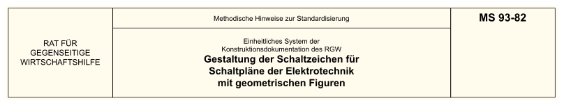

*
Abschrift aus TGL Textsammlung[†](#1)
["ESKD – Schaltzeichen der Elektrotechnik"][MS 93-82]
*

---

[MS 93-82]: https://bauarchivddr.bbr-server.de/bauarchivddr/archiv/tglarchiv/tgl-em/tgl-em-011-1985.pdf#page=192 "Lizenz-Nr. 1005-184/3/85 Einheitliches System der Konstruktionsdokumentation des RGW. Schaltzeichen der Elektrotechnik. Ausgabe 1985, ab Seite 381"

Diese methodischen Hinweise gelten für manuell oder maschinell hergestellte
Schaltpläne der Elektrotechnik für Erzeugnisse aller Industriezweige und legen
die Regeln für die Gestaltung von Schaltzeichen mittels einer geometrischen
Grundfigur fest. Diese methodischen Hinweise sind zusammen mit
**[MS 79-81]**[†](#1) anzuwenden. Bei der Gestaltung
von Schaltzeichen sind auch die Forderungen des
**[ST RGW 158-75]**[†](#1) zu berücksichtigen.

[MS 79-81]: https://bauarchivddr.bbr-server.de/bauarchivddr/archiv/tglarchiv/tgl-em/tgl-em-013-1987.pdf#page=137 "ISBN 3-7405-0015-8 (Lizenz-Nr. 105-184/1/87) Einheitliches System der Konstruktionsdokumentation des RGW. Grundlagen. Ausgabe 1987, ab Seite 269"
[ST RGW 158-75]: https://bauarchivddr.bbr-server.de/bauarchivddr/archiv/tglarchiv/tglrgw144-75bis2873-81/tgl-rgw-158-75-nov-1976.pdf "TGL RGW 158-75 11/1976 Einheitliches System der Konstruktionsdokumentation des RGW. Schaltpläne der Elektrotechnik. Allgemeine Forderungen an die Ausführung"

Die in diesen methodischen Hinweisen verwendeten Termini sind in
[Anlage 1](#anlage-1--termini-und-definitionen) enthalten.

# 1. ALLGEMEINE GRUNDSÄTZE

<dl><dt>1.1.</dt><dd>

Das Schaltzeichen ist ein Mittel zur Übermittlung von Informationen über
Funktion und Aufbau von Schaltplänen der Elektrotechnik. Es wird in Form eines
oder mehrerer Schaltzeichen mit festgelegter Bedeutung gestaltet. Zum
Schaltzeichen können auch aus Buchstaben bestehende qualifizierende
Kennzeichen gehören. Mit Hilfe des Schaltzeichens werden Informationen über
die funktionellen Eigenschaften der Bauelemente, Geräte und Einrichtungen
übermittelt.

</dd><dt>1.2.</dt><dd>

Das Schaltzeichen für Schaltpläne der Elektrotechnik wird als Zeichen
entworfen, dessen Form nicht der Darstellung der realen Konstruktion des
Bauelementes entspricht.

</dd><dt>1.3.</dt><dd>

Die Abmessung des Schaltzeichens hat keinen Einfluss auf seine Bedeutung,
seine Vergrößerung jedoch weist auf die Wichtigkeit des funktionellen
Bauelementes hin. Der Einfluss der Lage des Schaltzeichens einschließlich der
Lage von zusätzlichen Zeichen ist in **[ST RGW 158-75]**[†](#1)
festgelegt.

</dd><dt>1.4.</dt><dd>

Bei der Gestaltung eines neuen oder bei der Änderung eines vorhandenen
Schaltzeichens sind die Forderungen der maschinellen Ausführung des
Schaltzeichens zu berücksichtigen, um die Aufnahme eines Schaltzeichens in ein
anderes zu ermöglichen, einfachste Formen zu erreichen sowie auch den
Programmierungsprozess zu erleichtern.

</dd><dt>1.5.</dt><dd>

Bei der Gestaltung von Schaltzeichen nach der Grundfigur wird eine Verwendung
geschwärzter Flächen nicht empfohlen.

</dd></dl>

# 2. GRUNDFIGUR B

<dl><dt>2.1.</dt><dd>

Zur Gewährleistung der Einheitlichkeit der Schaltzeichen und ihrer rationellen
Anordnung auf dem Schaltplan sowie auch zur Vereinfachung der Gestaltung ist
beim Entwurf neuer oder bei der Überarbeitung bereits vorhandener
Schaltzeichen die **Grundfigur B** zu verwenden. Die Abmessung des
Schaltzeichens wird durch den **Modul** der Grundfigur B bestimmt. Als Modul
wird die Länge einer Seite des Grundquadrats angenommen.

</dd><dt>2.2.</dt><dd>

Die Form der Grundfigur B ist <a href="#img-1">Bild 1</a> zu entnehmen. Die
Grundfigur B besteht aus folgenden einfachen geometrischen Elementen:

 1. **Hauptquadrat** mit den Seitenlängen, die als Modul angenommen wurde.
 2. **Hauptrechteck** mit einer Seitenlänge von 1 × 2 des Moduls.
 3. **Hauptkreis** mit einem Durchmesser, der gleich dem Modul ist.
 4. **Gleichschenkliges Dreieck** mit einer Grundlinie und Höhe, die gleich dem
    Modul ist.
 5. **Umschreibender Kreis** mit einem Durchmesser von 1,4 des Moduls.
 6. **Zusätzlicher Kreis** mit einem Durchmesser von 1,8 des Moduls.
 7. **Zusätzlicher Kreis** mit einem Durchmesser, der gleich dem Modul ist.
 8. **Zusätzlicher Kreis** mit einem Durchmesser von 0,6 des Moduls.
 9. **Zusätzliches Quadrat** mit einer Seitenlänge von 1,4 des Moduls.
10. **Zusätzliches Rechteck** mit den Seitenlängen von 1,4 × 2,4 des Moduls.
11. **Zusätzliche Halbkreise** zur Gestaltung von ovalen Formen.
12. **Koordinatenursprung**

***Anmerkung:*** *Bei manueller Ausführung eines Schaltzeichens kann das
gleichschenklige Dreieck (Position 4) in der Grundfigur B durch ein
gleichseitiges Dreieck mit der gleichen Grundlinie ersetzt werden.*

</dd><dt/><dd>

| ![Bild 1]
| :-:
| *Bild 1 – Grundfigur B*

[Bild 1]: MS-93-82/020100-Grundfigur-B.svg "Bild 1 – Grundfigur B"

</dd><dt>2.3.</dt><dd>

Die einfachen geometrischen Elemente der Grundfigur B stehen in einer
geometrischen Wechselbeziehung zueinander. Sie werden entweder ganz oder nur
teilweise für den Entwurf der Formen konkreter Schaltzeichen verwendet. Im
Bedarfsfall können auch die Diagonalen des Grundquadrats und der Hilfsfiguren
verwendet werden, die im oder außerhalb des Grundquadrats mit unterbrochener
Linie dargestellt sind. Die Grundfigur B kann um 90° gedreht werden.

</dd><dt>2.4.</dt><dd>

Die Grundfigur B ist auf einem Raster gezeichnet, der zur bequemeren
Ermittlung der Maße eines konkreten Schaltzeichens dient. Der Modul des
Hauptquadrats beträgt 10 Teile, das Maß des zusätzlichen, gestrichelt
gezeichneten Quadrats 14 Teile. Im Hauptrechteck sind die Seiten gleich
10 × 20 Teile, die längeren Seiten können um ein beliebiges Vielfaches von
5 Teilen verlängert werden. Im zusätzlichen Rechteck sind die Seiten gleich
14 × 24 Teile, es ist aber auch ein Rechteck mit den Seiten 10 × 15 Teile
zulässig.

Außerdem kann ein zweites zusätzliches Rechteck, gestrichelt gezeichnet mit
den Seiten 14 × 19 Teile verwendet werden, das um ein beliebiges Vielfaches
von 5 vergrößert werden kann.

Der Modul der Grundfigur B in Millimetern wird aus der in **Absatz 2.4. in**
**[MS 79-81]**[†](#1) angeführten Reihe ausgewählt, ausgenommen der
in elektrischen Schaltplänen nicht zulässige Wert von 3,5.

</dd><dt>2.5.</dt><dd>

Die Grundfigur B ist in erster Linie für die Gestaltung von allgemeinen
Schaltzeichen sowie nach Möglichkeit für die Gestaltung von qualifizierenden
Kennzeichen zu verwenden.

Die Grundfigur B ist nicht für Schaltzeichen integrierter Schaltkreise in der
Analog- und Digital-Technik zu verwenden. Form und Abmessung dieser
Schaltzeichen sind durch **ST RGW 3336-81**
(**[TGL 16057]**[†](#1)) und **ST RGW 3735-82**
(**[TGL 16056/01]**[†](#1), **[TGL 16056/02]**[†](#1)
und **[TGL 16056/03]**[†](#1)) festgelegt.

[TGL 16056/01]: https://bauarchivddr.bbr-server.de/bauarchivddr/archiv/tglarchiv/tgl10001bis20000/tgl16001bis16500/tgl-16056-1-mai-1984.pdf "TGL 16056/01 5/1984 Einheitliches System der Konstruktionsdokumentation des RGW. Schaltzeichen für Elemente der digitalen Technik. Bildungsregeln"
[TGL 16056/02]: https://bauarchivddr.bbr-server.de/bauarchivddr/archiv/tglarchiv/tgl10001bis20000/tgl16001bis16500/tgl-16056-2-mai-1984.pdf "TGL 16056/01 5/1984 Einheitliches System der Konstruktionsdokumentation des RGW. Schaltzeichen für Elemente der digitalen Technik. Marken, Anschlussbezeichnungen"
[TGL 16056/03]: https://bauarchivddr.bbr-server.de/bauarchivddr/archiv/tglarchiv/tgl10001bis20000/tgl16001bis16500/tgl-16056-3-mai-1984.pdf "TGL 16056/01 5/1984 Einheitliches System der Konstruktionsdokumentation des RGW. Schaltzeichen für Elemente der digitalen Technik. Vereinfachungen, Beispiele"
[TGL 16057]: https://bauarchivddr.bbr-server.de/bauarchivddr/archiv/tglarchiv/tgl10001bis20000/tgl16001bis16500/tgl-16057-aug-1983.pdf "TGL 16057 8/1983 Einheitliches System der Konstruktionsdokumentation des RGW. Schaltzeichen für Elemente der Analogtechnik"

Beispiele für die Ausführung der Schaltzeichen unter Verwendung der Grundfigur
B sind in [Anlage 2](#anlage-2--beispiele) angegeben (die Linienbreite der
genannten Schaltzeichen entspricht ¹⁄₂₈ des Moduls der Grundfigur B).

</dd></dl>

# 3. PRINZIPIEN DER GESTALTUNG UND ANWENDUNG VON SCHALTZEICHEN

<dl><dt>3.1.</dt><dd>

Bei der Gestaltung von konkreten Schaltzeichen ist das Grundprinzip die
Wiedergabe der Eigenschaft bzw. der Funktion des darzustellenden Bauelementes,
der Einrichtung oder des Gerätes. Diese Darstellung muss einfach und
einprägsam sein für die Mitarbeiter, die Schaltpläne der Elektrotechnik
projektieren, zeichnen und benutzen. Dieser Prozess ist ähnlich dem Prozess
der Gestaltung von Sinnbildern als Ersatz für Aufschriften auf Frontplatten
von Geräten und Einrichtungen, mit denen die Schaltzeichen für Schaltpläne der
Elektrotechnik in engem Zusammenhang stehen. Überall dort, wo es möglich ist,
sollten sie gleich sein.

</dd><dt>3.2.</dt><dd>

Das Schaltzeichen wird mit Hilfe der Grundfigur B so ausgeführt, dass der
Einsatz einfacher geometrischer Elemente möglich ist, und dass das
Schaltzeichen selbst in seinen Maßen und seiner Zweckbestimmung den
Forderungen des **[ST RGW 526-77]**[†](#1) und schon vorhandenen
Schaltzeichen entspricht.

[ST RGW 526-77]: https://bauarchivddr.bbr-server.de/bauarchivddr/archiv/tglarchiv/tgl-em/tgl-em-013-1987.pdf#page=22 "ISBN 3-7405-0015-8 (Lizenz-Nr. 105-184/1/87) Einheitliches System der Konstruktionsdokumentation des RGW. Grundlagen. Ausgabe 1987, ab Seite 39"

***Anmerkung:*** *In Anbetracht dessen, dass bei der repro-grafischen
Vervielfältigung der Unterlagen die Kontrastwirkung geschwärzter Flächen
sinken kann, ist anzustreben, dass Schaltzeichen gleicher Form mit
geschwärzter und nicht geschwärzter Oberflächen die gleiche Bedeutung haben.*

</dd><dt>3.3.</dt><dd>

Qualifizierende Kennzeichen werden bei Bedarf neben oder innerhalb des
allgemeinen Schaltzeichens angeordnet. Als qualifizierende Kennzeichen werden
die Schaltzeichen nach **ST RGW 141-74**
(**[TGL 16005 12/1976]**[†](#1),
**[TGL 16006 12/1976]**[†](#1) und
**[TGL 16007 12/1976]**[†](#1) – ersetzt durch
**[TGL 16005 3/1989]**[†](#1) als **ST RGW 5679-86**),
**ST RGW 1984-79** (**[TGL 16019]**[†](#1)) oder andere, in
den einzelnen RGW-Standards für Schaltzeichen in Schaltplänen der
Elektrotechnik aufgeführte, verwendet.

[TGL 16005 3/1989]: https://bauarchivddr.bbr-server.de/bauarchivddr/archiv/tglarchiv/tgl10001bis20000/tgl16001bis16500/tgl-16005-mrz-1989.pdf "TGL 16005 3/1989 Einheitliches System der Konstruktionsdokumentation. Schaltzeichen Schaltzeichenelemente, Allgemeine Kennzeichen"
[TGL 16005 12/1976]: https://bauarchivddr.bbr-server.de/bauarchivddr/archiv/tglarchiv/tgl10001bis20000/tgl16001bis16500/tgl-16005-dez-1976.pdf "TGL 16005 12/1976 Schaltzeichen der Elektrotechnik. Allgemeine Kennzeichen"
[TGL 16006 12/1976]: https://bauarchivddr.bbr-server.de/bauarchivddr/archiv/tglarchiv/tgl10001bis20000/tgl16001bis16500/tgl-16006-dez-1976.pdf "TGL 16006 12/1976 Schaltzeichen der Elektrotechnik. Kennzeichen für Spannungs-, Strom- und Schaltarten"
[TGL 16007 12/1976]: https://bauarchivddr.bbr-server.de/bauarchivddr/archiv/tglarchiv/tgl10001bis20000/tgl16001bis16500/tgl-16007-dez-1976.pdf "TGL 16007 12/1976 Schaltzeichen der Elektrotechnik. Leitungen und Leitungsverbindungen"
[TGL 16019]: https://bauarchivddr.bbr-server.de/bauarchivddr/archiv/tglarchiv/tgl10001bis20000/tgl16001bis16500/tgl-16019-jun-1982.pdf "TGL 16019 6/1982 Einheitliches System der Konstruktionsdokumentation des RGW. Schaltzeichen für mechanische Verbindungen, Antriebe und Vorrichtungen"

</dd><dt>3.4.</dt><dd>

Wenn bei der Gestaltung eines Schaltzeichens die mit einer durchgehenden Linie
gezeichneten einfachen geometrischen Elemente der Grundfigur B nicht
ausreichen, werden die innerhalb bzw. außerhalb des Grundquadrats gestrichelt
gezeichneten Hilfselemente verwendet. Sie werden zum Beispiel beim
Schaltzeichen für den Kondensator, für ein piezoelektrisches Bauelement, für
einen Lautsprecher, eine Fernsehbildröhre usw. verwendet. Für eine Gruppe von
Schaltzeichen für Kontakte dient als Ausgangspunkt der Koordinatenursprung
(Position 12).

Für die zu gestaltenden Schaltzeichen wird in der Regel eine symmetrische
Anordnung gewählt, die einfachen geometrischen Figuren können daher verschoben
werden. Dieses Prinzip gilt auch für die Gestaltung eines Schaltzeichens mit
qualifizierenden Kennzeichen. Bei Bedarf, wenn Eigenschaften oder Funktionen
dargestellt werden sollen, können die Schaltzeichen auch asymmetrisch
aufgebaut sein.

</dd><dt>3.5.</dt><dd>

Zur Ausführung der Schaltzeichen werden in der Regel Linien einer Breite
verwendet. Die Breite soll einer Liniengruppe/-Untergruppe aus **Tabelle 1**
in **[ST RGW 1178-78]**[†](#1) entsprechen. Die Linienbreite wird
aus der Reihe ¹⁄₂₈, ¹⁄₂₀, ¹⁄₁₄ des Moduls der Grundfigur B gemäß Tabelle
ausgewählt.

[ST RGW 1178-78]: https://bauarchivddr.bbr-server.de/bauarchivddr/archiv/tglarchiv/tgl-em/tgl-em-013-1987.pdf#page=39 "ISBN 3-7405-0015-8 (Lizenz-Nr. 105-184/1/87) Einheitliches System der Konstruktionsdokumentation des RGW. Grundlagen. Ausgabe 1987, ab Seite 71"

<table align="center">
<thead><tr>
<th align="center" valign="top" colspan=2>

Modul der Grundfigur B

</th><th align="center" valign="top" rowspan=2>

Verhältnis zum Modul

</th><th align="center" valign="top" colspan=2>

Breite der schmalen Linie `s`

</th><th align="center" valign="top" rowspan=2>

Gruppe mit Untergruppe

</th><th align="center" valign="top" colspan=2>

Ein Teil des Rasters (10 Teile im Modul)

</th><th align="center" valign="top" colspan=2>

Abstand der Mitte paralleler Linien

</th>
</tr><tr>
<th align="center" valign="top">㎜</th>
<th align="center" valign="top">㏕</th>
<th align="center" valign="top">㎜</th>
<th align="center" valign="top">㏕</th>
<th align="center" valign="top">㎜</th>
<th align="center" valign="top">㏕</th>
<th align="center" valign="top">㎜</th>
<th align="center" valign="top">㏕</th>
</tr></thead>
<tbody><tr>
<td align="center" rowspan=2>5</td>
<td align="center" rowspan=2>200</td>
<td align="center">¹⁄₁₄</td>
<td align="center">0,35</td>
<td align="center">14</td>
<td align="center">3b</td>
<td align="center" rowspan=2>0,50</td>
<td align="center" rowspan=2>20</td>
<td align="center">1,50</td>
<td align="center">60</td>
</tr><tr>
<td align="center" rowspan=2>¹⁄₂₀</td>
<td align="center">0,25</td>
<td align="center">10</td>
<td align="center">2b</td>
<td align="center">1,00</td>
<td align="center">40</td>
</tr><tr>
<td align="center">7</td>
<td align="center">280</td>
<td align="center" rowspan=2>0,35</td>
<td align="center" rowspan=2>14</td>
<td align="center" rowspan=2>3b</td>
<td align="center">0,70</td>
<td align="center">28</td>
<td align="center">1,40</td>
<td align="center">56</td>
</tr><tr>
<td align="center">10</td>
<td align="center">400</td>
<td align="center" rowspan=3>¹⁄₂₈</td>
<td align="center">1,00</td>
<td align="center">40</td>
<td align="center">1,00</td>
<td align="center">40</td>
</tr><tr>
<td align="center">14</td>
<td align="center">560</td>
<td align="center">0,50</td>
<td align="center">20</td>
<td align="center">4b</td>
<td align="center">1,40</td>
<td align="center">56</td>
<td align="center">1,40</td>
<td align="center">56</td>
</tr><tr>
<td align="center">20</td>
<td align="center">800</td>
<td align="center">0,70</td>
<td align="center">28</td>
<td align="center">5b</td>
<td align="center">2,00</td>
<td align="center">80</td>
<td align="center">2,00</td>
<td align="center">80</td>
</tr></tbody>
</table>

Bei der Gestaltung eines Schaltzeichens ist das Prinzip einzuhalten, dass zwei
parallele Linien einen Abstand voneinander von 2 `s` haben, der bei dem
Verhältnis:

¹⁄₂₈ – gleich einem Teil des Rasters der Grundfigur B, 
¹⁄₂₀ – gleich zwei Teilen, 
¹⁄₁₄ – gleich drei Teilen ist.

Bei der Ausführung kurzer paralleler Linien brauchen die genannten Forderungen
nicht berücksichtigt zu werden.

</dd><dt>3.6.</dt><dd>

In Standards des ESKD RGW für Schaltzeichen der Elektrotechnik werden keine
Maße angegeben. Die Schaltzeichen werden als Beispiele ausgeführt, wobei ein
quadratisches Raster mit einer beliebigen Seitenlänge verwendet wird, das die
Deutlichkeit und Eindeutigkeit des Schaltzeichens garantiert
(<a href="#img-2">Bild 2</a>).

| ![Bild 2]
| :-:
| *Bild 2 – Deutlichkeit und Eindeutigkeit des Schaltzeichens*

[Bild 2]: MS-93-82/030100-Beispiel.svg "Bild 2 – Deutlichkeit und Eindeutigkeit des Schaltzeichens"

</dd></dl>

# 4. FORDERUNGEN AN DAS MASCHINELLE ZEICHNEN VON SCHALTUNGEN

Die Ausführung von Schaltzeichen unter den Bedingungen des Systems der
automatisierten Projektierung muss den Forderungen des
**[ST RGW 526-77]**[†](#1) entsprechen. Hierbei muss die
Möglichkeit bestehen, die Schaltzeichen mittels zusätzlicher manueller
Bearbeitung auszuführen. Zur Steuerung des Zeichenautomaten sind beim
Programmieren die Eingangsdaten auf Loch- oder Magnetbändern unter
Berücksichtigung der Art der Grundfigur B vorzubereiten.

# Anlage 1 – TERMINI UND DEFINITIONEN

## Schaltzeichen

Darstellung, Zeichen oder Buchstaben, die einen Gegenstand (oder Begriff) und
seine charakteristische Funktion oder Eigenschaft auf einem Schaltplan der
Elektrotechnik oder in einem anderen Dokument darstellen. Das Schaltzeichen
stellt einen Bestandteil, ein Funktionselement, ein Gerät oder eine
Einrichtung dar und kann aus einem allgemeinen und einem qualifizierenden
Kennzeichen gebildet werden.

## Funktionselement des Schaltzeichens

Symbol, das aus einfachen geometrischen Elementen der *Grundfigur B*
konstruiert ist. Das Symbol drückt die Hauptfunktion oder Eigenschaften aus.
Das Schaltzeichen entsteht durch Kombination von Elementen des Schaltzeichens.

## Allgemeine Schaltzeichen

Vertreter einer Gruppe (Familie) von Schaltzeichen für eine bestimmte
Gruppe ähnlicher Teile, Funktionselemente, Geräte u.ä. Es ist gewöhnlich
einfach. Das spezielle Schaltzeichen entsteht durch Hinzufügen eines
qualifizierenden Kennzeichens zu einem Schaltzeichen.

## Qualifizierendes Kennzeichen

Präzisiert oder definiert das allgemeine Schaltzeichen für die konkrete
Anwendung. Stellt einzelne physikalische Erscheinungen dar sowie
Teilfunktionen oder Eigenschaften, die für viele Schaltzeichen allgemeingültig
sind.

**Anmerkung:** Zu den qualifizierenden Kennzeichen gehören auch Schaltzeichen
für Grundbestandteile (oder Funktionselemente). Das Schaltzeichen für den
Kondensator wird z.B. als qualifizierendes Kennzeichen des Mikrofons
verwendet, um ein Kondensatormikrofon darzustellen.

## Blockschaltzeichen

Vereinfachte Darstellung einer elektronischen Schaltung (eines Gerätes,
Komplexes) die keine Einzelheiten der Funktion oder aller ihrer Anschlüsse
wiedergibt. Als Schaltzeichen werden einfache geometrische Figuren (Quadrate,
Rechtecke usw.) verwendet.

**Anmerkung:** Blockschaltzeichen werden in Schaltplänen mit einliniger
Darstellung verwendet, sie können jedoch auch mit allen Anschlüssen ausgeführt
werden. Gewöhnlich verwendet in Struktur- (101) und Funktions- (102)
Schaltplänen.

# Anlage 2 – BEISPIELE

**Beispiele für die Ausführung von Schaltzeichen unter Verwendung der
Grundfigur B.**

<dl><dt>A2.1.</dt><dd>

| ![Bild 3]
| :-:
| *Bild 3 – Festwiderstand*

[Bild 3]: MS-93-82/200100-Festwiderstand.svg "Bild 3 – Festwiderstand"

| ![Bild 3a]
| :-:
| *Bild 3a – Veränderbarer Widerstand*

[Bild 3a]: MS-93-82/200101-Veränderbarer-Widerstand.svg "Bild 3a – Veränderbarer Widerstand"

| ![Bild 3b]
| :-:
| *Bild 3b – Nichtlinearer Widerstand*

[Bild 3b]: MS-93-82/200102-Nichtlinearer-Widerstand.svg "Bild 3b – Nichtlinearer Widerstand"

</dd><dt>A2.2.</dt><dd>

| ![Bild 4]
| :-:
| *Bild 4 – Kondensator*

[Bild 4]: MS-93-82/200200-Kondensator.svg "Bild 4 – Kondensator"

| ![Bild 4a]
| :-:
| *Bild 4a – Veränderbarer Kondensator*

[Bild 4a]: MS-93-82/200201-Veränderbarer-Kondensator.svg "Bild 4a – Veränderbarer Kondensator"

| ![Bild 4b]
| :-:
| *Bild 4b – Elektrolytkondensator, gepolt*

[Bild 4b]: MS-93-82/200202-Elektrolytkondensator-gepolt.svg "Bild 4b – Elektrolytkondensator, gepolt"

| ![Bild 4c]
| :-:
| *Bild 4c – Elektrolytkondensator, ungepolt*

[Bild 4c]: MS-93-82/200203-Elektrolytkondensator-ungepolt.svg "Bild 4c – Elektrolytkondensator, ungepolt"

| ![Bild 4d]
| :-:
| *Bild 4d – Durchführungskondensator, einfach geschirmt*

[Bild 4d]: MS-93-82/200204-Durchführungskondensator-einfach-geschirmt.svg "Bild 4d – Durchführungskondensator, einfach geschirmt"

| ![Bild 4e]
| :-:
| *Bild 4e – Durchführungskondensator, doppelt geschirmt*

[Bild 4e]: MS-93-82/200205-Durchführungskondensator-doppelt-geschirmt.svg "Bild 4e – Durchführungskondensator, doppelt geschirmt"

</dd><dt>A2.3.</dt><dd>

| ![Bild 5]
| :-:
| *Bild 5 – Piezoelektrisches Bauelement*

[Bild 5]: MS-93-82/200300-Piezoelektrisches-Bauelement.svg "Bild 5 – Piezoelektrisches Bauelement"

</dd><dt>A2.4.</dt><dd>

| ![Bild 6]
| :-:
| *Bild 6 – Glühlampe*

[Bild 6]: MS-93-82/200400-Glühlampe.svg "Bild 6 – Glühlampe"

</dd><dt>A2.5.</dt><dd>

| ![Bild 7]
| :-:
| *Bild 7 – Gasentladungsröhre*

[Bild 7]: MS-93-82/200500-Gasentladungsröhre.svg "Bild 7 – Gasentladungsröhre"

</dd><dt>A2.6.</dt><dd>

| ![Bild 8]
| :-:
| *Bild 8 – Elektrische Klingel*

[Bild 8]: MS-93-82/200600-Elektrische-Klingel.svg "Bild 8 – Elektrische Klingel"

</dd><dt>A2.7.</dt><dd>

| ![Bild 9]
| :-:
| *Bild 9 – Lautsprecher*

[Bild 9]: MS-93-82/200700-Lautsprecher.svg "Bild 9 – Lautsprecher"

</dd><dt>A2.8.</dt><dd>

| ![Bild 10]
| :-:
| *Bild 10 – Mikrofon*

[Bild 10]: MS-93-82/200800-Mikrofon.svg "Bild 10 – Mikrofon"

</dd><dt>A2.9.</dt><dd>

| ![Bild 11]
| :-:
| *Bild 11 – Tonkopf*

[Bild 11]: MS-93-82/200900-Tonkopf.svg "Bild 11 – Tonkopf"

</dd></dl>

</dd><dt>A2.10.</dt><dd>

| ![Bild 12]
| :-:
| *Bild 12 – Diode*

[Bild 12]: MS-93-82/201000-Diode.svg "Bild 12 – Diode"

</dd><dt>A2.11.</dt><dd>

| ![Bild 13]
| :-:
| *Bild 13 – Transistor*

[Bild 13]: MS-93-82/201100-Transistor.svg "Bild 13 – Transistor"

</dd><dt>A2.12.</dt><dd>

| ![Bild 14]
| :-:
| *Bild 14 – Triodenthyristor*

[Bild 14]: MS-93-82/201200-Triodenthyristor.svg "Bild 14 – Triodenthyristor"

</dd><dt>A2.13.</dt><dd>

| ![Bild 15]
| :-:
| *Bild 15 – Schließkontakt*

[Bild 15]: MS-93-82/201300-Schließkontakt.svg "Bild 15 – Schließkontakt"

</dd><dt>A2.14.</dt><dd>

| ![Bild 16]
| :-:
| *Bild 16 – Öffnungskontakt*

[Bild 16]: MS-93-82/201400-Öffnungskontakt.svg "Bild 16 – Öffnungskontakt"

</dd><dt>A2.15.</dt><dd>

| ![Bild 17]
| :-:
| *Bild 17 – Umschaltkontakt*

[Bild 17]: MS-93-82/201500-Umschaltkontakt.svg "Bild 17 – Umschaltkontakt"

</dd><dt>A2.16.</dt><dd>

| ![Bild 18]
| :-:
| *Bild 18 – Verstärker*

[Bild 18]: MS-93-82/201600-Verstärker.svg "Bild 18 – Verstärker"

</dd><dt>A2.17.</dt><dd>

| ![Bild 19]
| :-:
| *Bild 19 – Impulswandler*

[Bild 19]: MS-93-82/201700-Impulswandler.svg "Bild 19 – Impulswandler"

</dd><dt>A2.18.</dt><dd>

| ![Bild 20]
| :-:
| *Bild 20 – Fernsprechapparat*

[Bild 20]: MS-93-82/201800-Fernsprechapparat.svg "Bild 20 – Fernsprechapparat"

</dd><dt>A2.19.</dt><dd>

| ![Bild 21]
| :-:
| *Bild 21 – Galvanisches Element*

[Bild 21]: MS-93-82/201900-Galvanisches-Element.svg "Bild 21 – Galvanisches Element"

</dd><dt>A2.20.</dt><dd>

| ![Bild 22]
| :-:
| *Bild 22 – Spule einer elektromechanischen Einrichtung*

[Bild 22]: MS-93-82/202000-Spule-einer-elektromechanischen-Einrichtung.svg "Bild 22 – Spule einer elektromechanischen Einrichtung"

</dd><dt>A2.21.</dt><dd>

| ![Bild 23]
| :-:
| *Bild 23 – Spule einer elektromechanischen Einrichtung mit Beschleunigung*

[Bild 23]: MS-93-82/202100-Spule-einer-elektromechanischen-Einrichtung-mit-Beschleunigung.svg "Bild 23 – Spule einer elektromechanischen Einrichtung mit Beschleunigung"

</dd><dt>A2.22.</dt><dd>

| ![Bild 24]
| :-:
| *Bild 24 – Motor*

[Bild 24]: MS-93-82/202200-Motor.svg "Bild 24 – Motor"

</dd><dt>A2.23.</dt><dd>

| ![Bild 25]
| :-:
| *Bild 25 – Industrieofen*

[Bild 25]: MS-93-82/202300-Industrieofen.svg "Bild 25 – Industrieofen"

</dd><dt>A2.24.</dt><dd>

| ![Bild 26]
| :-:
| *Bild 26 – Gleichrichter*

[Bild 26]: MS-93-82/202400-Gleichrichter.svg "Bild 26 – Gleichrichter"

</dd><dt>A2.25.</dt><dd>

| ![Bild 27]
| :-:
| *Bild 27 – Wähler*

[Bild 27]: MS-93-82/202500-Wähler.svg "Bild 27 – Wähler"

</dd><dt>A2.26.</dt><dd>

| ![Bild 28]
| :-:
| *Bild 28 – Telefonumschalter*

[Bild 28]: MS-93-82/202600-Telefonumschalter.svg "Bild 28 – Telefonumschalter"

</dd><dt>A2.27.</dt><dd>

| ![Bild 29]
| :-:
| *Bild 29 – Vakuumröhre*

[Bild 29]: MS-93-82/202700-Vakuumröhre.svg "Bild 29 – Vakuumröhre"

</dd><dt>A2.28.</dt><dd>

| ![Bild 30]
| :-:
| *Bild 30 – Optoelektronisches Bauelement*

[Bild 30]: MS-93-82/202800-Optoelektronisches-Bauelement.svg "Bild 30 – Optoelektronisches Bauelement"

| ![Bild 30a]
| :-:
| *Bild 30a – Lichtemitterdiode*

[Bild 30a]: MS-93-82/202801-Lichtemitterdiode.svg "Bild 30a – Lichtemitterdiode"

</dd><dt>A2.29.</dt><dd>

| ![Bild 31]
| :-:
| *Bild 31 – Kolben einer Elektrohnenröhre*

[Bild 31]: MS-93-82/202900-Kolben-einer-Elektrohnenröhre.svg "Bild 31 – Kolben einer Elektrohnenröhre"

| ![Bild 31a]
| :-:
| *Bild 31a – Pentode*

[Bild 31a]: MS-93-82/202901-Pentode.svg "Bild 31a – Pentode"

| ![Bild 31b]
| :-:
| *Bild 31b – Doppeltriode*

[Bild 31b]: MS-93-82/202902-Doppeltriode.svg "Bild 31b – Doppeltriode"

</dd><dt>A2.30.</dt><dd>

| ![Bild 32]
| :-:
| *Bild 32 – Kolben einer Fernsehbildröhre*

[Bild 32]: MS-93-82/203000-Kolben-einer-Fernsehbildröhre.svg "Bild 32 – Kolben einer Fernsehbildröhre"

| ![Bild 32a]
| :-:
| *Bild 32a – Fernsehbildröhre mit elektrostatischer Ablenkung*

[Bild 32a]: MS-93-82/203001-Fernsehbildröhre-mit-elektrostatischer-Ablenkung.svg "Bild 32a – Fernsehbildröhre mit elektrostatischer Ablenkung"

| ![Bild 32b]
| :-:
| *Bild 32b – Fernsehbildröhre mit elektromagnetischer Ablenkung*

[Bild 32b]: MS-93-82/203002-Fernsehbildröhre-mit-elektromagnetischer-Ablenkung.svg "Bild 32b – Fernsehbildröhre mit elektromagnetischer Ablenkung"

</dd><dt>A2.31.</dt><dd>

| ![Bild 33]
| :-:
| *Bild 33 – Übertrager*

[Bild 33]: MS-93-82/203100-Übertrager.svg "Bild 33 – Übertrager"

| ![Bild 33a]
| :-:
| *Bild 33a – Einphasentransformator*

[Bild 33a]: MS-93-82/203101-Einphasentransformator.svg "Bild 33a – Einphasentransformator"

| ![Bild 33b]
| :-:
| *Bild 33b – Spule mit einstellbarem Massekern*

[Bild 33b]: MS-93-82/203102-Spule-mit-einstellbarem-Massekern.svg "Bild 33b – Spule mit einstellbarem Massekern"

| ![Bild 33c]
| :-:
| *Bild 33c – Spule ohne Kern*

[Bild 33c]: MS-93-82/203103-Spule-ohne-Kern.svg "Bild 33c – Spule ohne Kern"

| ![Bild 33d]
| :-:
| *Bild 33d – Veränderbare Spule mit ferromagnetischem-Kern*

[Bild 33d]: MS-93-82/203104-Veränderbare-Spule-mit-ferromagnetischem-Kern.svg "Bild 33d – Veränderbare Spule mit ferromagnetischem Kern"

</dd><dt>A2.32.</dt><dd>

| ![Bild 34]
| :-:
| *Bild 34 – Antenne*

[Bild 34]: MS-93-82/203200-Antenne.svg "Bild 34 – Antenne"

| ![Bild 34a]
| :-:
| *Bild 34a – Ferritantenne*

[Bild 34a]: MS-93-82/203201-Ferritantenne.svg "Bild 34a – Ferritantenne"

| ![Bild 34b]
| :-:
| *Bild 34b – Dipolantenne*

[Bild 34b]: MS-93-82/203202-Dipolantenne.svg "Bild 34b – Dipolantenne"

| ![Bild 34c]
| :-:
| *Bild 34c – Schleifendipolantenne*

[Bild 34c]: MS-93-82/203203-Schleifendipolantenne.svg "Bild 34c – Schleifendipolantenne"

| ![Bild 34d]
| :-:
| *Bild 34d – Parabolantenne*

[Bild 34d]: MS-93-82/203204-Parabolantenne.svg "Bild 34d – Parabolantenne"

</dd><dt>A2.33.</dt><dd>

| ![Bild 35]
| :-:
| *Bild 35 – Fernschreiber*

[Bild 35]: MS-93-82/203300-Fernschreiber.svg "Bild 35 – Fernschreiber"

</dd></dl>

---

**Quellverzeichnis und Fußnoten:**

* https://d-nb.info/551201940
* https://d-nb.info/1162284072
* https://www.bbr-server.de/bauarchivddr/finbuch/tgl/index.htm
* https://www.uni-weimar.de/de/universitaet/struktur/zentrale-einrichtungen/universitaetsbibliothek/recherche/normen/tgl-verzeichnis/

†
: lokale Kopie
: [MS 79-81][MS 79-81 lokal],
  [MS 93-82][MS 93-82 lokal],
  [ST RGW 158-75][ST RGW 158-75 lokal],
  [ST RGW 526-77][ST RGW 526-77 lokal],
  [ST RGW 1178-78][ST RGW 1178-78 lokal],
  [TGL 16005 3/1989][TGL 16005 3/1989 lokal],
  [TGL 16005 12/1976][TGL 16005 12/1976 lokal],
  [TGL 16006 12/1976][TGL 16006 12/1976 lokal],
  [TGL 16007 12/1976][TGL 16007 12/1976 lokal],
  [TGL 16019][TGL 16019 lokal],
  [TGL 16056/01][TGL 16056/01 lokal],
  [TGL 16056/02][TGL 16056/02 lokal],
  [TGL 16056/03][TGL 16056/03 lokal],
  [TGL 16057][TGL 16057 lokal]

[MS 79-81 lokal]: MS-79-81/tgl-em-013-1987.pdf#page=137 "lokal: ISBN 3-7405-0015-8 (Lizenz-Nr. 105-184/1/87) Ausgabe 1987, ab Seite 269"
[MS 93-82 lokal]: MS-93-82/tgl-em-011-1985.pdf#page=192 "lokal: Lizenz-Nr. 1005-184/3/85 Ausgabe 1985, ab Seite 381"
[ST RGW 158-75 lokal]: ST-RGW-158-75/tgl-rgw-158-75-nov-1976.pdf "lokal: TGL RGW 158-75 11/1976"
[ST RGW 526-77 lokal]: MS-79-81/tgl-em-013-1987.pdf#page=22 "lokal: ISBN 3-7405-0015-8 (Lizenz-Nr. 105-184/1/87) Ausgabe 1987, ab Seite 39"
[ST RGW 1178-78 lokal]: MS-79-81/tgl-em-013-1987.pdf#page=39 "lokal: ISBN 3-7405-0015-8 (Lizenz-Nr. 105-184/1/87) Ausgabe 1987, ab Seite 71"
[TGL 16005 3/1989 lokal]: ST-RGW-5679-86/tgl-16005-mrz-1989.pdf "lokal: TGL 16005 3/1989"
[TGL 16005 12/1976 lokal]: ST-RGW-141-74/tgl-16005-dez-1976.pdf "lokal: TGL 16005 12/1976"
[TGL 16006 12/1976 lokal]: ST-RGW-141-74/tgl-16006-dez-1976.pdf "lokal: TGL 16006 12/1976"
[TGL 16007 12/1976 lokal]: ST-RGW-141-74/tgl-16007-dez-1976.pdf "lokal: TGL 16007 12/1976"
[TGL 16019 lokal]: ST-RGW-1984-79/tgl-16019-jun-1982.pdf "lokal TGL 16019 6/1982"
[TGL 16056/01 lokal]: ST-RGW-3735-82/tgl-16056-1-mai-1984.pdf "lokal: TGL 16056/01 5/1984"
[TGL 16056/02 lokal]: ST-RGW-3735-82/tgl-16056-2-mai-1984.pdf "lokal: TGL 16056/02 5/1984"
[TGL 16056/03 lokal]: ST-RGW-3735-82/tgl-16056-3-mai-1984.pdf "lokal: TGL 16056/03 5/1984"
[TGL 16057 lokal]: ST-RGW-3336-81/tgl-16057-aug-1983.pdf "lokal: TGL 16057 8/1983"

<!--
vim: ft=markdown tw=78 ts=4 sw=4 et ai:
-->
